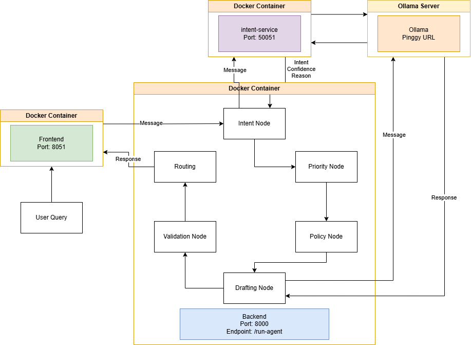

# Banking Agentic Workflow

This project implements an intelligent, agent-based customer service system for a banking environment. The system utilizes a microservice architecture, communicating via gRPC and RESTful HTTP APIs, and relies on Large Language Models (LLMs) via Ollama to detect intents, draft responses, and make automated routing decisions.

---

## Microservice Architecture





The system is designed following a modern microservice approach, decoupled into three distinct services that work together to form the "Agentic Workflow". 

### 1. API Gateway (Backend)
- **Framework:** FastAPI
- **Port:** `8000`
- **Role:** Acts as the main entry point and the **Orchestrator** of the agentic workflow. It receives customer messages from the frontend, routes them to the Intent Service via gRPC to detect the customer's intent, executes internal business nodes (Priority Detection, Policy Retrieval, Validation, Routing), and communicates with Ollama (HTTP) to draft the final response.

### 2. Intent Service (gRPC)
- **Framework:** gRPC (Python)
- **Port:** `50051`
- **Role:** A dedicated, independent microservice strictly responsible for **Intent Detection**. It receives a customer message via a gRPC call from the API Gateway, processes it through an LLM (Ollama) or a fine-tuned model, and returns the predicted intent, a confidence score, and the reasoning behind the prediction.

### 3. Frontend (Chat Interface)
- **Framework:** Streamlit
- **Port:** `8501`
- **Role:** Provides a premium, glassmorphism-styled chat interface for the end-user. It maintains the session state of the conversation and communicates with the API Gateway via HTTP POST requests (`/run-agent`) to display the agent's responses and routing decisions.

---

## Generating gRPC Code

Before running the system (especially if running locally without Docker), you must generate the Python gRPC client and server code from the `intent_service.proto` file.

1. Ensure you have the required tools installed:
   ```bash
   pip install grpcio grpcio-tools
   ```
2. Navigate to the `intent_service` directory and run the protocol buffer compiler:
   ```bash
   cd intent_service
   python -m grpc_tools.protoc -I. --python_out=./intent_grpc --grpc_python_out=./intent_grpc intent_service.proto
   ```
3. Repeat the same generation process for the backend client if necessary, or simply ensure the backend points to the correctly generated `intent_grpc` package.

---

## Docker Containerization & Deployment

This project is fully containerized. Each service has its own `Dockerfile`, and the entire environment is orchestrated using `docker-compose`.

### Prerequisites
- **Docker** & **Docker Compose** installed on your machine.
- **Ollama** running either locally or hosted remotely (e.g., Google Colab via Pinggy). Ensure your `.env` files contain the correct `OLLAMA_BASE_URL`.

### Building the Docker Images
You can build the individual Docker images manually, though Docker Compose handles this automatically. If you wish to build them independently:
```bash
# Build API Gateway
docker build -t banking-api-gateway ./backend

# Build Intent Service
docker build -t banking-intent-service ./intent_service

# Build Frontend
docker build -t banking-frontend ./frontend
```

### Running the System with Docker Compose
To build and run the entire microservice architecture simultaneously, simply run the following command from the root directory of the project:

```bash
# Build the images and start the containers in detached mode
docker-compose up --build -d
```

### Accessing the Services
Once the containers are up and running, you can access the services at:
- **Frontend Chat Interface:** [http://localhost:8501](http://localhost:8501)
- **API Gateway Health Check:** [http://localhost:8000/health](http://localhost:8000/health)

To stop the system, run:
```bash
docker-compose down
```